# Mermaid 学习笔记（Typora 2024 版 · 一站式速查）

> 已按「由浅入深」重新分级排版，所有代码块 **Typora 1.7.x 可直接渲染**，旧语法已剔除。

---

## 🏗️ 一、流程图 Flowchart

### 1.1 方向速记
| 代码 | 含义 |
|---|---|
| `TB` | 从上到下 |
| `BT` | 从下到上 |
| `RL` | 从右到左 |
| `LR` | 从左到右 |

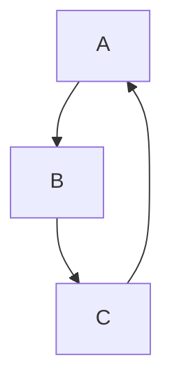

---

### 1.2 节点形状与连线

| 写法 | 形状 | 备注 |
|---|---|---|
| `A[文字]` | 矩形 | 通用 |
| `A(文字)` | 圆角矩形 | 开始/结束 |
| `A((文字))` | 圆形 | 连接节点 |
| `A{文字}` | 菱形 | 判断 |
| `A>文字]` | 右向旗帜 | 少用 |

⚠️ 易踩坑  
- 节点名只接受 **字母/数字/下划线**；中文需整体加双引号  
- 连线 **不能有空格**：`A-->B` ✅ `A -- > B` ❌

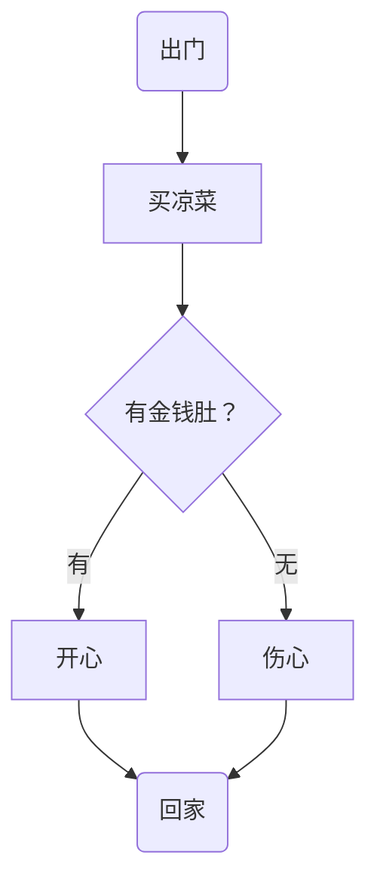

---

### 1.3 连线大全

| 符号 | 含义 | 备注 |
|---|---|---|
| `-->` | 实线箭头 | ✅ |
| `---` | 实线无箭头 | ✅ |
| `-- 文本 -->` | 带文字箭头 | ✅ |
| `-.->` | 虚线箭头 | ✅ |
| `===` / `==>` | 加粗 | ✅ |
| `--x` / `-x>` | ❌ 已废弃 | 用 `-->` |

---

### 1.4 子图 & 并行

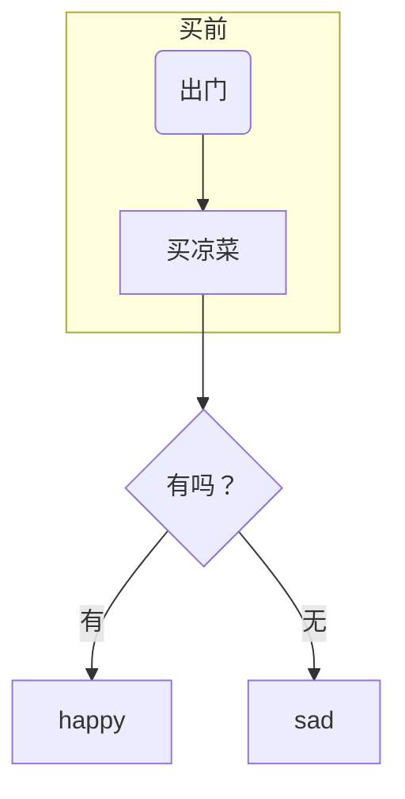

---

## 🧾 二、序列图 Sequence Diagram

> 固定开头：`sequenceDiagram`

### 2.1 参与者与别名
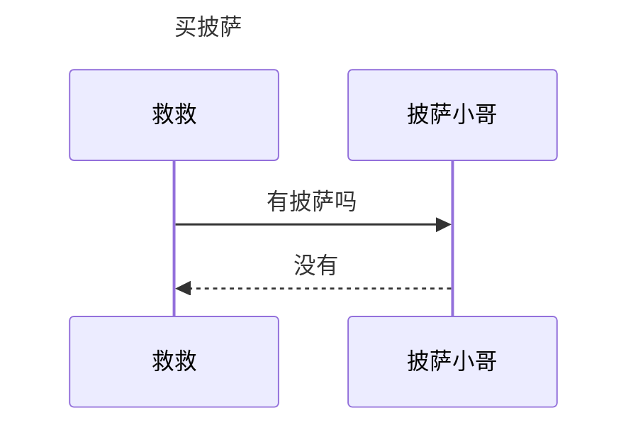

⚠️ 中文必须 `participant 标识符 as 中文名` 或用双引号包裹。

---

### 2.2 消息线速查

| 符号 | 含义 | 备注 |
|---|---|---|
| `->>` | 实线箭头 | 通用 |
| `-->>` | 虚线箭头 | 通用 |
| `-x>` / `--x>` | ❌ 已废弃 | 用 `->>` |
| `activate` / `deactivate` | 激活框 | 推荐 |

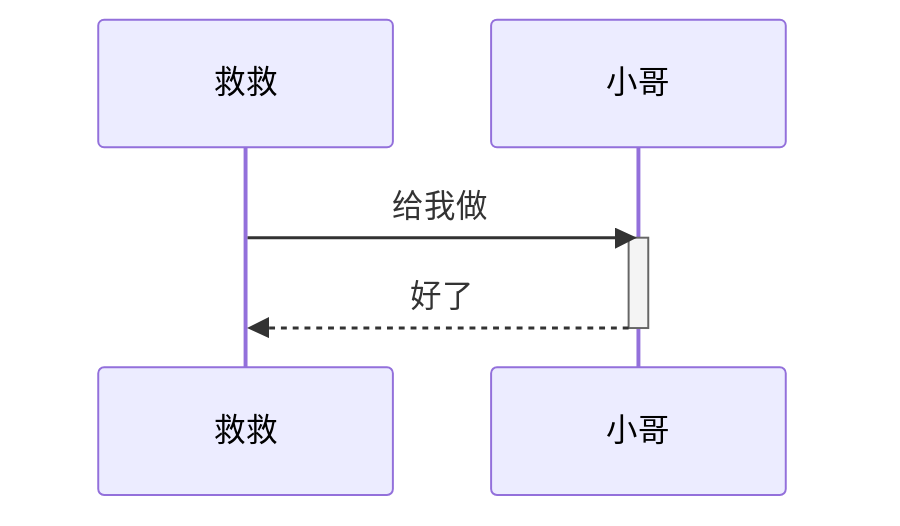

---

### 2.3 注解 note

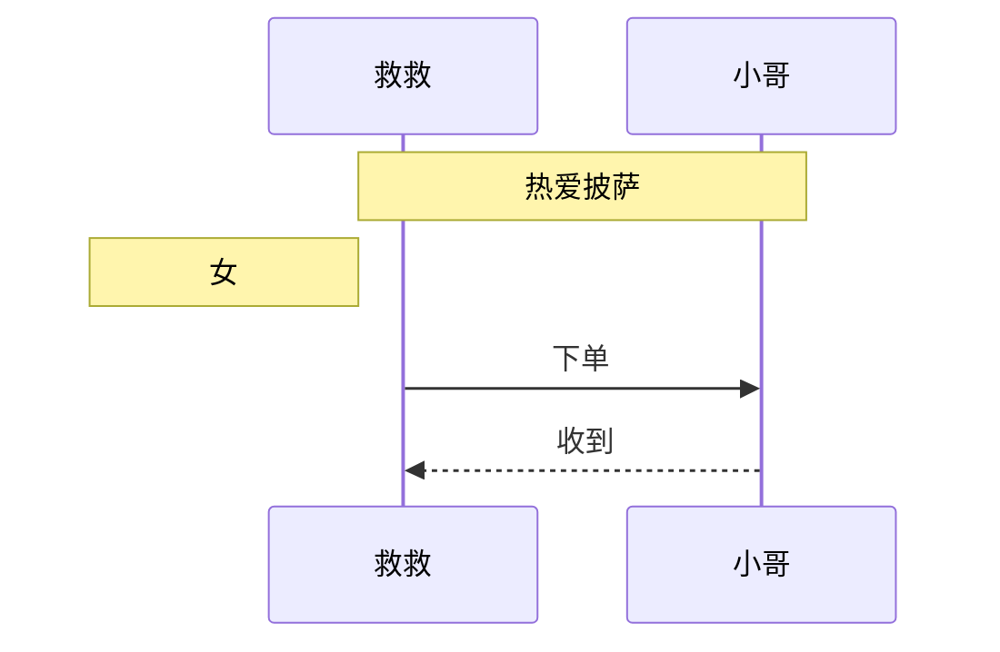

---

### 2.4 高级结构

#### 循环
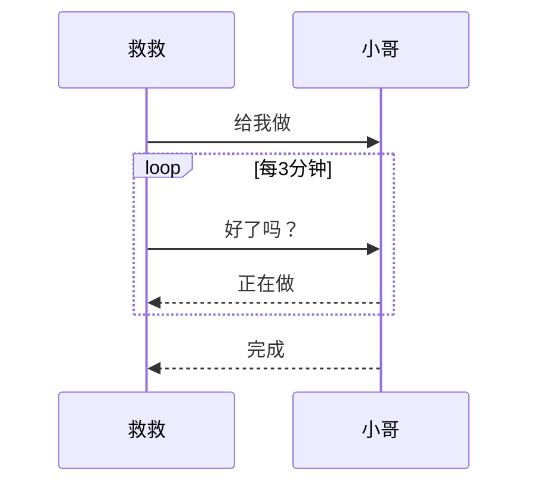

#### 选择 alt / 可选 opt / 并行 par
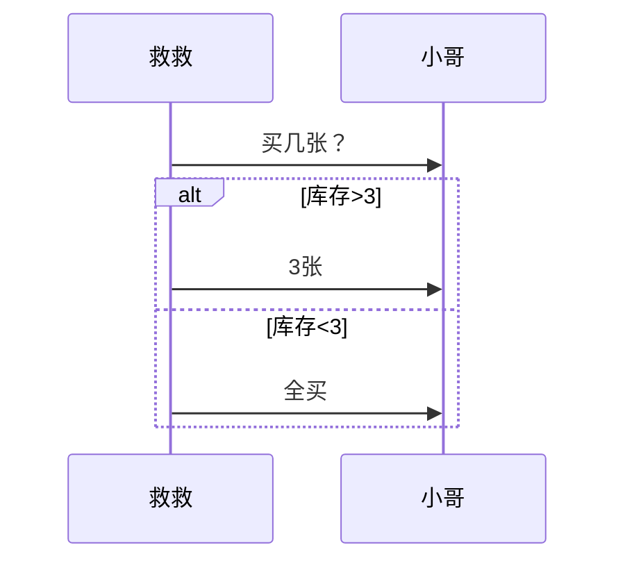

---

## 🥧 三、饼图 Pie

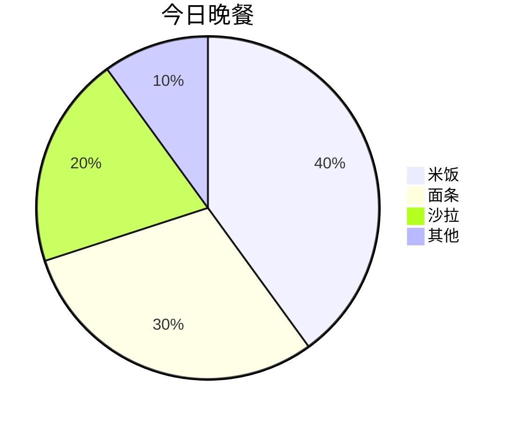

---

## 📅 四、甘特图 Gantt

> 里程碑写法（旧版 Typora 无法渲染 `milestone`，改用 0 长度任务）

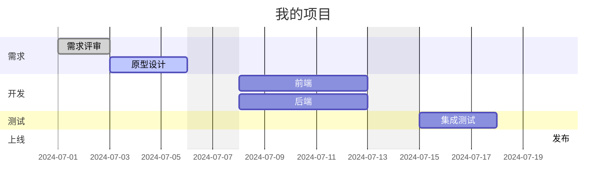
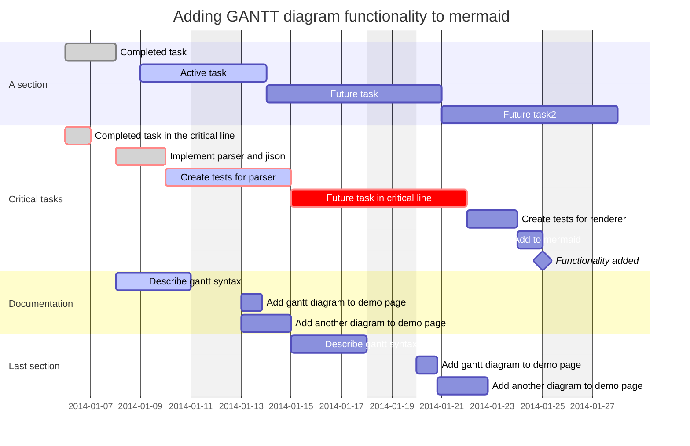

---

## 🚨 踩雷速查表

| 错误示例 | 正确姿势 |
|---|---|
| 中文节点名 | `participant J as 救救` 或 `"救救"` |
| `-x>` / `--x>` | ❌ 已废弃，用 `-->` |
| 中文冒号 `：` | 英文 `:` |
| `loop / alt / par` 不顶格 | 关键字 **顶格**，内容缩进 2 空格 |
| 日期格式 2024-7-1 | 补零 2024-07-01 |
| 代码块语言写成 `sequence` | 统一写 `mermaid` |

